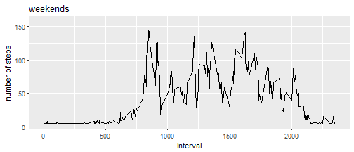

```r
require(ggplot2)
require(dplyr)
require(data.table)
getdataset<-function()
{
        dir<-utils::getSrcDirectory(function(x) {x})
        a<-list.files(path = dir)
        file0<-"activity.csv"
        if (!(file0%in%a))
        {
                b<-file.info(a)
                c<-which(b$size== 53559)
                if (length(c)>0)
                {
                        unzip(zipfile = row.names(b)[c])
                }
                else 
                {
                        download.file("https://d396qusza40orc.cloudfront.net/repdata%2Fdata%2Factivity.zip", destfile = "activitymonitoring.zip",mode='wb', cacheOK=FALSE)        
                        unzip(zipfile = "activitymonitoring.zip")
                }
        }  

        df00<-read.csv(file0)
        
        assign("df00",df00, envir = .GlobalEnv)
        
        
}
getdataset()

df001<-df00%>%
        group_by(date)%>%
                summarise(steps=sum(steps))
hist(df001$steps,xlab="steps",main = "Number of steps taken per day")
```


```r
cat("mean of the total number of steps taken per day:",mean(df001$steps,na.rm = T));
```

```
## mean of the total number of steps taken per day: 10766.19
```

```r
cat(" median of the total number of steps taken per day:",median(df001$steps,na.rm = T))
```

```
##  median of the total number of steps taken per day: 10765
```

```r
print("If a day has only missing values they are imputed with mean values across the dataset. The rest are imputed with mean for that day")
```

```
## [1] "If a day has only missing values they are imputed with mean values across the dataset. The rest are imputed with mean for that day"
```

```r
missing<-df00%>%group_by(date)%>%summarise(mis= all(is.na(steps)))
missingdays<-missing$date[missing$mis==TRUE]

df01<-df00%>%
        group_by(date)%>%
                summarise(steps=mean(steps),na.rm = T)
df02<-df00%>%
        filter(date%in%missingdays)
df02$steps[is.na(df02$steps)]<-mean(df01$steps,na.rm = T)

df02<-bind_rows(df00%>%filter(!(date%in%missingdays)),df02)%>%
                mutate(date=as.Date(date,format='%Y-%m-%d'))
df002<-df02%>%
        group_by(interval)%>%
                summarise(meanstep=mean(steps))

qplot(x=interval,y=meanstep,data=df002,geom=c("line"),xlab="interval",ylab="number of steps")+labs(title = "mean number of steps")
```


```r
cat("interval",df002$interval[df002$meanstep==max(df002$meanstep)],"on average across all the days in the dataset, contains the maximum number of steps")
```

```
## interval 835 on average across all the days in the dataset, contains the maximum number of steps
```

```r
df03<-df02%>%
        group_by(date)%>%
                mutate(steps = ifelse(is.na(steps), median(steps, na.rm = T), steps))

df04<-df03%>%
        group_by(date)%>%
                summarise(steps=sum(steps))

hist(df04$steps,xlab="steps",main = "Number of steps taken per day")
```


```r
df05<-df02%>%
                mutate(day=weekdays(date))%>%
                          mutate(day =as.factor( ifelse(day%in%c("Saturday","Sunday"), "weekend", "weekday")))

weekend<-df05%>%
        filter(day=="weekend")%>%
                group_by(interval)%>%
                        summarise(steps=mean(steps))


qplot(x=interval,y=steps,data=weekend,geom=c("line"),xlab="interval",ylab="number of steps")+labs(title = "weekends")
```



```r
weekday<-df05%>%
                filter(day=="weekday")%>%
                        group_by(interval)%>%
                                summarise(steps=mean(steps))
qplot(x=interval,y=steps,data=weekday,geom=c("line"),xlab="interval",ylab="number of steps")+labs(title = "weekdays")
```


